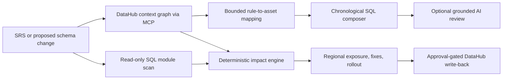

<div align="center">

# contextIsKey

### Context before action.

**Turn an SRS or incident brief into a grounded, chronological investigation, before a schema change becomes an outage.**

[Open the live demo](https://changeproof-production.up.railway.app/triage) · [Architecture documentation](https://rishvaiyer.github.io/context-is-key/) · [Workflow](#workflow)

Apache-2.0. Built on the official [DataHub MCP server](https://docs.datahub.com/docs/features/feature-guides/mcp).

</div>

> **Demo note:** The public Railway demo uses deterministic synthetic DataHub-shaped context for speed and reliability. The repository also includes an opt-in integration verified against a local DataHub instance through the official MCP server. No fake cloud connection is claimed.

## How DataHub powers contextIsKey

DataHub is the governed context graph behind the product. It gives contextIsKey the meaning around a piece of data, not just the value stored in a row:

- **Discovery:** find the datasets and columns that match an incident requirement.
- **Schema:** confirm the field identity and neighboring fields before composing SQL.
- **Entities:** retrieve owners, domains, glossary terms, criticality, and structured metadata.
- **Lineage:** trace upstream and downstream dependencies across tables, columns, and dashboards.
- **Query history:** surface real usage patterns, joins, filters, and aggregations that declared lineage may miss.
- **Governance:** prepare incident, tag, and documentation changes behind human approval.

The official DataHub MCP server is the read interface for the live path. contextIsKey adds the change-specific layer: it maps SRS rules to context, composes a chronological investigation, discovers hidden SQL consumers, translates impact into regions, and produces reviewable fixes. In the hosted demo, the same contract is backed by a deterministic synthetic context bundle so the behavior remains reproducible.

## The problem in one sentence

An AI can write a plausible SQL query in seconds. It cannot safely change an enterprise identifier until it knows which columns, owners, dashboards, stored procedures, business rules, and regions depend on that identifier.

## What contextIsKey does

```text
SRS / incident brief
        ↓
DataHub context: search · schema · entities · lineage · query history
        ↓
Bounded rule-to-asset mapping + chronological SQL investigation
        ↓
Impact graph · hidden SQL consumers · regional exposure
        ↓
Reviewable fixes · validation · rollback · rollout gates
```

### At a glance

| Area | What it does |
| --- | --- |
| **DataHub lookups** | Named context lookups for datasets, columns, owners, glossary terms, lineage, entities, and query history. |
| **Analysis** | Document extraction, deterministic rule-to-asset mapping, SQL module discovery, impact graph, exports, and SARIF. |
| **Scenario** | A cross-functional accounts-receivable incident spanning Commerce, Finance, Payments, Returns, Fulfillment, Identity, and Regional Policy. |
| **Safeguards** | No automatic SQL execution, no silent AI changes, explicit unmapped rules, human approval, and rollback controls. |

## Workflow

Use the prepared AsterVale Living scenario:

```text
Column:        customer_id
Current type: varchar
Proposed type: bigint
```

Start with the included accounts-receivable incident, then visit seven focused workspaces:

1. **Triage Composer:** map an SRS to datasets, columns, owners, domains, glossary terms, and a reviewable chronological SQL query.
2. **Analyze:** frame a proposed contract change and see the enterprise summary.
3. **Impact graph:** combine DataHub lineage with hidden SQL Server module findings.
4. **Regions:** map assets, stored procedures, owners, and review flags across Northeast, South, Midwest, West, and unknown metadata.
5. **Fix Studio:** review generated SQL, validation queries, rollback controls, JSON, and SARIF artifacts.
6. **Rollout:** follow a dependency-ordered migration with explicit gates.
7. **DataHub actions:** approve individual incident, tag, and documentation drafts.

## Quick walkthrough

1. Open the [Triage Composer](https://changeproof-production.up.railway.app/triage).
2. Click **Load example** or upload the included SRS-style incident brief.
3. Point out the **Context graph coverage** cards: the app names the context types that shaped the result.
4. Scroll to **How DataHub context helped, step by step**. Each lookup explains how metadata changed the query.
5. Open **Impact graph** to show DataHub lineage plus the four hidden SQL Server consumers.
6. Open **Regions** to turn technical dependencies into an executive risk view.
7. Finish in **Fix Studio**: download the query, proposed fixes, validation SQL, rollback SQL, JSON, or SARIF.

The story is intentionally simple: **a type change is not a SQL edit; it is a context problem.**

### Upload any SRS or incident document

Open `/triage` and either paste requirements or upload a PDF, DOCX, TXT, Markdown, SQL, or CSV file. contextIsKey extracts the text for the current response, shows a document receipt, and lets you review the extracted requirements before clicking **Interpret document with AI**.

Ready-to-upload synthetic examples live in [`docs/examples/`](docs/examples/). The AsterVale accounts-receivable SRS is the primary recording flow; the other two documents show how the same context layer handles a contract migration and a regional returns investigation.

The flow is deliberately bounded:

```text
Document -> extracted rules -> DataHub search/schema/lineage context -> chronological SQL
```

The original binary is discarded after extraction. OpenAI receives extracted text only after the explicit AI action. AI can organize rules and explain the result; it cannot invent a DataHub asset, column, owner, lineage edge, or execution result.

## Product surfaces

The UI is designed to make the context chain visible at a glance, not hide it behind a chat transcript.

<table>
  <tr>
    <td width="50%"></td>
    <td width="50%"></td>
  </tr>
  <tr>
    <td><strong>Triage Composer</strong><br />Document upload, extracted SRS rules, privacy boundary, and DataHub-shaped context.</td>
    <td><strong>Impact graph</strong><br />Column-level lineage joined to hidden SQL consumers that catalog graphs cannot always observe.</td>
  </tr>
  <tr>
    <td width="50%"></td>
    <td width="50%"></td>
  </tr>
  <tr>
    <td><strong>Regional exposure</strong><br />Technical blast radius translated into an operating-risk view across five region groups.</td>
    <td><strong>Fix Studio</strong><br />Reviewable SQL drafts, manual-review flags, rollback artifacts, and no-auto-execution controls.</td>
  </tr>
</table>

## Enterprise scenario

AsterVale Living is a fictional national home-furnishings retailer with 420 stores and six regional distribution centers. All company, customer, procedure, and regional data is synthetic.

The Triage Composer begins with a cross-functional AR discrepancy. Nine SRS rules span Commerce, Finance, Payments, Returns, Fulfillment, Customer Identity, and Regional Policy. Seven bounded lookups against the hosted synthetic context select 7 datasets, 34 schema fields, 7 owners, 7 domains, and 7 glossary terms before composing the query. One unsupported rule stays visibly unmapped instead of being invented.

The proposed edit is:

```text
stg_orders.customer_id: varchar -> bigint
```

DataHub evidence exposes this downstream chain:

```text
stg_orders.customer_id
  -> fct_order_sales
  -> loyalty_customer_value [critical]
  -> regional_returns
  -> executive_revenue_dashboard [critical]
```

contextIsKey also searches SQL Server module definitions and finds four code-level consumers, including `CONVERT`, `CAST`, join logic, and dynamic SQL. Recognized convert and cast expressions receive reviewable drafts. Joins and dynamic SQL are marked for manual review unless a semantic rewrite can be verified.

## What DataHub contributes

DataHub is the governed context graph, not a normal application database. contextIsKey uses its relationships as reasoning inputs:

- Dataset discovery across functional domains
- Column-level lineage and hop distance
- Dataset and schema-field identity
- Ownership metadata
- Business glossary terms and domains
- Critical-asset tags
- Metadata completeness and freshness
- Business grouping that can be represented with domains
- Regional context that can be represented with structured properties
- Official MCP tool contracts for search, entities, schema, lineage, and query-history reads
- GraphQL write-back for incidents, tags, and documentation

contextIsKey adds the incident and change decision layer:

- SRS-to-metadata rule mapping with explicit unmapped results
- Cross-domain chronological query composition
- A numbered record of every hosted context lookup and query decision
- Change-specific evidence scoring
- Hidden SQL dependency discovery
- Geographic blast-radius aggregation
- Generated migration and validation artifacts
- Dependency-ordered rollout and rollback
- Explicit AI second-pass review
- Human-approved DataHub write-back

### Exactly where the DataHub context appears

| DataHub capability | How contextIsKey uses it | Visible proof in the demo |
| --- | --- | --- |
| **Search** | Finds the best matching assets across functional domains from each SRS rule. | Triage mappings and the numbered evidence timeline. |
| **Schema fields** | Confirms the candidate column and its neighboring fields before composing SQL. | Selected columns and schema evidence on Triage Composer. |
| **Entities** | Reads ownership, domain, glossary, criticality, and structured metadata together. | Owner/domain/glossary rows and the Regional Exposure view. |
| **Lineage** | Walks upstream/downstream dependencies and hop distance from the proposed field. | Impact graph and critical downstream assets. |
| **Dataset query history** | Adds real query patterns so the investigation can find consumers beyond declared lineage. | Chronological SQL investigation and query-history step. |
| **Governed write-back** | Prepares incident, tag, and documentation proposals behind human approval. | DataHub Actions with explicit simulated/live state. |

This is the key distinction from a normal database: a database stores rows; DataHub explains how data assets relate, who owns them, what they mean, and where they flow. The agent uses that context to constrain its reasoning instead of guessing from names.

## Architecture



Core design boundaries:

- Hosted mode executes no database SQL.
- Hosted Triage Composer context is bundled and synthetic; it reproduces the shape of the live integration without claiming a live cloud connection.
- Generated SQL never executes automatically.
- AI runs only after the user clicks **Interpret document with AI** or **Run advisory AI review**.
- AI is advisory only. It cannot change risk scores, deterministic evidence, execution, or write-back.
- Backtick-delimited identifiers are checked against the evidence bundle, but free-form AI prose is never treated as authoritative discovery.
- Approval requests carry proposal IDs only. Catalog content is rebuilt server-side.
- Missing lineage, ownership, or region metadata stays visible as uncertainty.

## Generated artifacts

Every result can be downloaded as TXT or PDF. The Triage Composer also downloads its query as SQL. The Fix Studio exposes six deterministic artifacts:

- `impact-report.json`
- `discovery-query.sql`
- `proposed-fixes.sql`
- `validation-queries.sql`
- `rollback.sql`
- `changeproof.sarif`

## Schema-change gate for pull requests

Run the deterministic gate against the included schema-change fixture:

```bash
uv run contextiskey gate examples/input/rename_artist_id.json --output-dir gate-output
```

The command writes a Markdown decision report and SARIF result. It exits `0`
only when the change is supported automatically and the bundled graph has fresh,
complete evidence. Incomplete evidence, unsupported changes, removals, and type
changes remain review-gated and exit nonzero. The gate never executes SQL,
contacts DataHub, or performs write-back. Its evidence is explicitly labeled as
bundled, synthetic, and DataHub-shaped.

The included GitHub Actions workflow publishes the gate report as a review
artifact after pytest and Ruff pass.

## Run locally

Requires Python 3.12.

```bash
uv sync --extra dev
CHANGE_PROOF_WRITEBACK_MODE=simulated uv run uvicorn changeproof.app:app --reload
```

Open [http://localhost:8000](http://localhost:8000).

For the optional AI review:

```bash
export OPENAI_API_KEY="your-key"
```

The key alone makes no API request. A request occurs only after an explicit click.

## Live DataHub path

### No Cloud required for the demo

If you cannot provision DataHub Cloud tonight, leave the MCP URL and token unset. The public demo still runs end to end with a bundled, synthetic DataHub-shaped graph and labels that evidence mode honestly. Do not enter `YOUR_TENANT` literally; it is only a placeholder.

### Railway / DataHub Cloud

For a DataHub Cloud trial or an existing tenant, add these variables to the Railway service:

```text
DATAHUB_MCP_URL=https://YOUR_TENANT.acryl.io/integrations/ai/mcp/
DATAHUB_MCP_TOKEN=<DataHub personal access token>
CHANGE_PROOF_TRIAGE_DATAHUB=1
```

The token belongs in Railway Variables only. With this flag enabled, the Triage Composer uses the DataHub MCP server for search, schema fields, entities, lineage, and dataset query history. If a live call fails, the result falls back to bundled synthetic context and says so in the evidence mode label.

```bash
make live-demo
```

The current live integration:

- Builds the synthetic SonicLedger dbt and DuckDB fixture
- Emits schemas, owners, tags, table lineage, and fine-grained column lineage
- Reads schema and lineage through the official DataHub MCP server
- The triage path can also read search results, entity metadata, and dataset query history through the same MCP connection
- Uses the same deterministic impact and remediation engine
- Applies approved write-back proposals through DataHub GraphQL

Real GraphQL mutation mode is disabled by default. `make live-demo` enables it only for the trusted loopback runtime after the local DataHub checks pass.

The AsterVale regional properties are bundled synthetic evidence in hosted mode. They model the domains and structured properties an enterprise deployment would ingest. They are not presented as live DataHub Cloud data.

## Verify

```bash
uv run pytest -q
uv run ruff check .
```

The ordinary suite is credential-free. Live DataHub remains opt-in:

```bash
CHANGE_PROOF_LIVE_DATAHUB=1 uv run pytest tests/integration/test_datahub_context.py -q
```

## Context capability boundary

- **Used in the hosted flow:** datasets, columns, owners, domains, glossary terms, deterministic discovery, query composition, regional context, and reviewable exports.
- **Available through the included live path:** official MCP schema and lineage reads plus approval-gated GraphQL write-back.
- **Connect live DataHub to activate:** live quality and freshness signals, documentation relationships, dashboards and ML models, near-real-time metadata events, audit access, and governance policies.

## Current boundaries

- Hosted evidence is deterministic and synthetic, not a live DataHub Cloud connection.
- Uploaded document extraction is ephemeral; document files are not persisted.
- Live triage context requires `CHANGE_PROOF_TRIAGE_DATAHUB=1` plus `DATAHUB_MCP_URL` and `DATAHUB_MCP_TOKEN`.
- Hosted write-back is simulated and clearly labeled. It makes no network call.
- The local live path is the verified DataHub MCP and GraphQL integration.
- Static SQL discovery cannot guarantee complete dependency coverage.
- Dynamic SQL and absent region metadata require manual review.
- Regional flags are coordination signals, not legal-compliance determinations.

## How DataHub is used

The workflow constrains every decision with asset discovery, schema fields, entities, lineage, query history, ownership, glossary terms, and structured properties. Metadata goes in, an evidence-backed investigation comes out.

The hosted demo uses a deterministic DataHub-shaped evidence bundle. The included MCP adapter switches the same workflow to live DataHub context when a tenant is available.

The AsterVale Living dataset is synthetic, but the workflow models a real problem: a cross-functional identifier migration that has to be understood before it is changed.

## License

contextIsKey is available under the [Apache License 2.0](LICENSE).
